# Schedule 14D-9 Production Workflow

## Target's Solicitation / Recommendation Statement — LLM Capability Map v1.0

> **126 actionable steps** · **7 stages** · **5 validation gates** · **1 board deliberation freeze** · **9 SEC items**
> Covers the full production lifecycle from tender offer receipt through EDGAR filing within the 10-business-day deadline.

## LLM Capability Legend

| Color | Meaning | Node Style |
|-------|---------|------------|
| 🔴 Red | **LLM Cannot Do** — Human judgment, legal privilege, board decisions, sign-offs | Solid red fill |
| 🔴 Red (bold) | **Decision Diamond** — Human-only gate check | Dark red fill |
| 🔴 Red (dark) | **Milestone / Sign-Off** — Named accountability event | Deep red fill |
| 🟡 Yellow | **LLM Needs Human Oversight** — Can draft, human validates | Amber fill |
| 🟢 Green | **LLM Can Do Independently** — Research, formatting, compilation | Green fill |
| 🟢 Green (dark) | **Compile Step** — LLM assembles section from approved inputs | Dark green fill |

## Sign-Off Types

| Type | Meaning | Who |
|------|---------|-----|
| **ATTESTATION** | Factual data is accurate and verified | Management, Financial Advisor |
| **CERTIFICATION** | Document is production-ready, all items addressed, privilege-safe | Lead Counsel |
| **APPROVAL** | Board recommendation endorsed and authorized for filing | Board / Special Committee |
| **PREREQUISITE** | SEC disclosure and regulatory requirements fulfilled | SEC Counsel |

---

## Pre-Production: Engagement & Mobilization

> *Entirely 🔴 — board-level engagement decisions, privilege establishment, timeline calculation. The 10-business-day clock starts when the TO is filed.*

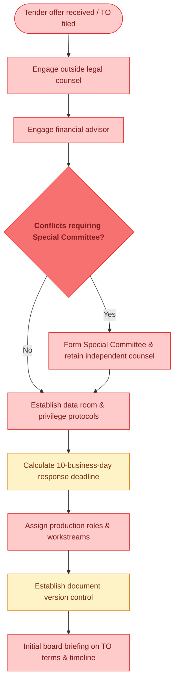

## 🚧 Gate 1: Factual Foundation Lock

> *Before any drafting begins, all transaction facts must be extracted, verified, and locked. Management attests to factual accuracy.*

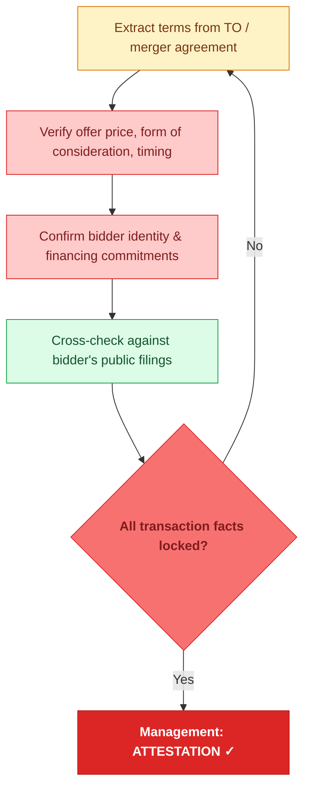

## Stage 1: Transaction Summary — Items 1–2

> *Mostly 🟢 — factual company information and transaction terms pulled from locked data. LLM compiles from verified inputs.*

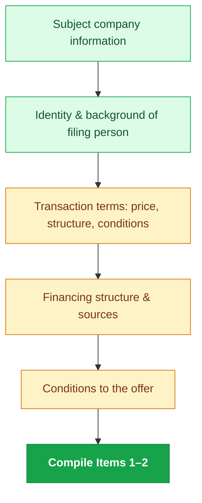

## Stage 2: Background of the Transaction

> *The most sensitive section. Blow-by-blow narrative of how the deal unfolded. Heavy 🔴 — board minutes, director interviews, privilege review. LLM can draft narrative from records but every paragraph needs legal review.*

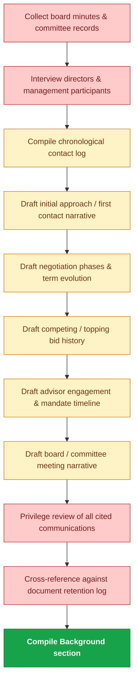

## 🚧 Gate 2: Background Narrative Verification

> *Every factual claim in the background verified against board records. Privilege review ensures no inadvertent waiver. Lead Counsel attests.*

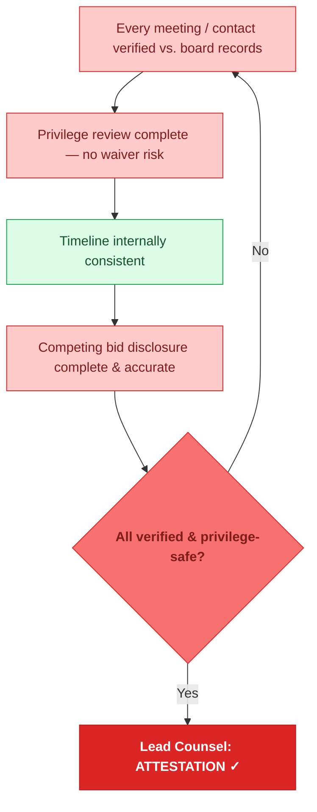

## Stage 3: Financial Analysis & Projections

> *Valuation summary drafting is heavily 🟢 — LLM formats comp tables, precedent transactions, DCF summaries. Management projections (🔴) require board approval. Financial advisor must review final summary for accuracy.*

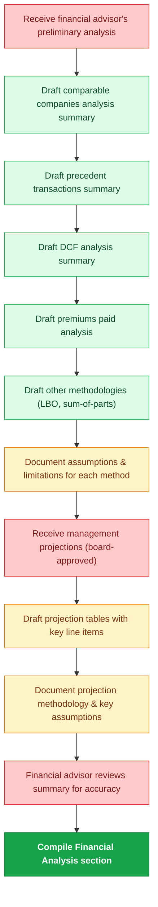

## 🚧 Gate 3: Fairness Opinion Lock

> *Fairness opinion letter received in final form. Summary in the 14D-9 must accurately reflect the full opinion. Financial advisor attests to accuracy.*

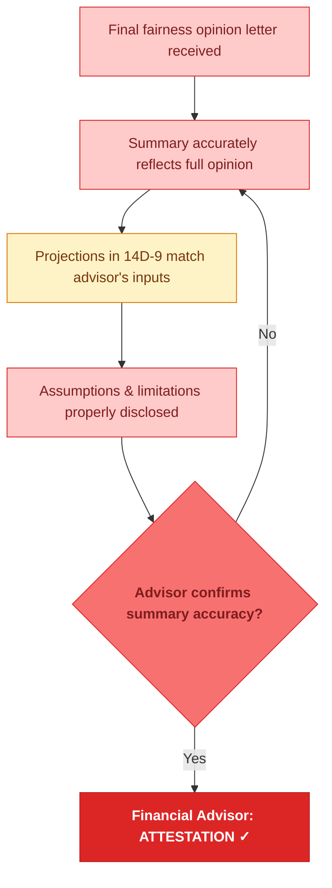

## ⚠ Board Deliberation — Required Before Recommendation

> *New in this workflow. The board must formally deliberate and vote before the recommendation and reasons sections can be drafted. All 7 nodes are 🔴 — this is a purely human governance event. No drafting of the recommendation may begin until this checkpoint clears.*

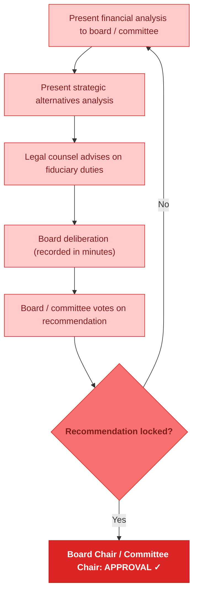

## Stage 4: Recommendation & Reasons

> *Mostly 🟡 — LLM drafts from board deliberation records, but every sentence needs legal review for fiduciary compliance. Dissenting views (🔴) are board-only. Revlon/Unocal review is outside counsel's domain.*

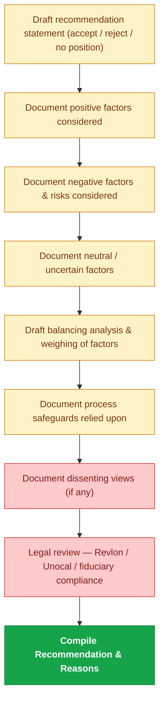

## Stage 5: Conflicts, Interests & Governance

> *Mixed 🔴/🟡 — equity holdings and golden parachute math are LLM-computable from data. Change-of-control terms, employment arrangements, and director relationships with the bidder require human disclosure. Legal reviews completeness.*

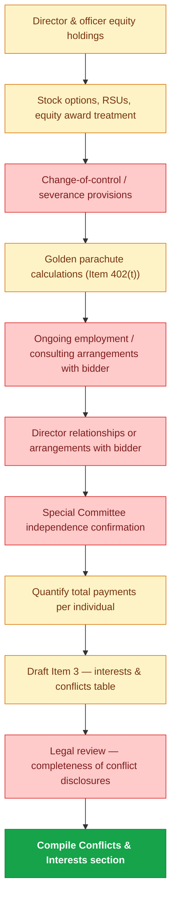

## Stage 6: Legal, Regulatory & Shareholder Rights

> *Heavy 🔴 — regulatory filings, intent to tender, and SEC compliance are counsel-driven. Appraisal rights drafting (🟡) uses state-law boilerplate but needs jurisdiction-specific review. Safe harbor language is 🟢.*

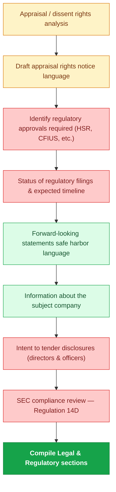

## 🚧 Gate 4: SEC Compliance Lock

> *Regulatory checkpoint. Every Schedule 14D-9 item addressed, Regulation 14D compliance confirmed, appraisal rights properly noticed. SEC Counsel provides governance prerequisite.*

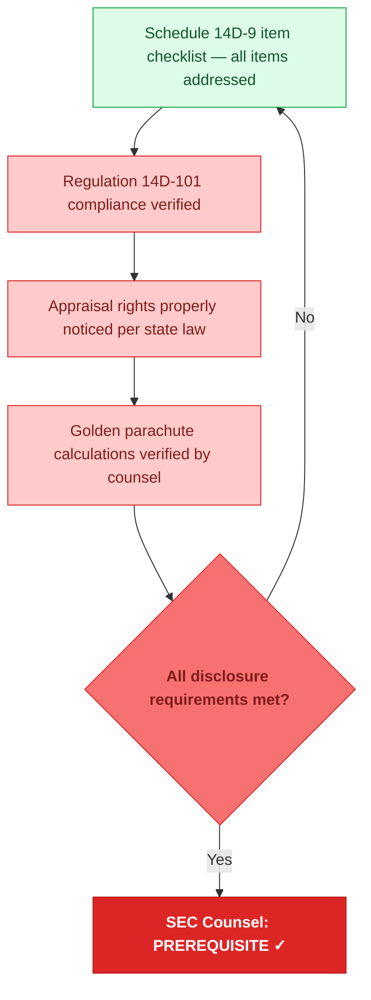

## Stage 7: Exhibits & Final Assembly

> *Mixed — exhibit attachment is 🔴 (legal instruments). Shareholder letter drafting is 🟡. Cross-referencing, compilation, and proofing are 🟢. EDGAR formatting is 🟡.*

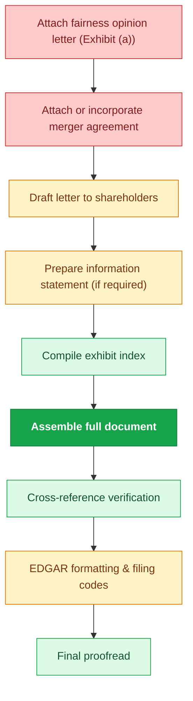

## 🚧 Gate 5: Final Review & Filing Authorization

> *12 QC checks followed by 4-tier sign-off chain. Board authorizes filing as final step before EDGAR submission. Sign-off order: attestations → certification → approval.*

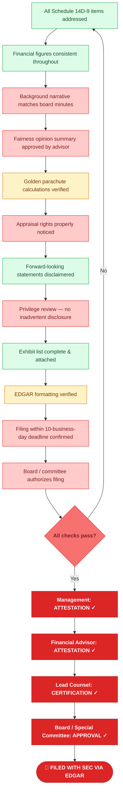

---

## Capability Summary

| Category | Approx. Steps | Examples |
|----------|:---:|---------|
| 🔴 **LLM Cannot Do** | ~66 | Board deliberations, privilege review, sign-offs, fairness opinion, management interviews, director conflicts, SEC compliance, regulatory filings, fiduciary review |
| 🟡 **LLM Needs Human Oversight** | ~34 | Background narrative drafting, projection tables, golden parachute calculations, recommendation factors, appraisal rights language, EDGAR formatting |
| 🟢 **LLM Can Do** | ~26 | Comparable company summaries, precedent transactions, DCF formatting, cross-reference checks, safe harbor language, item checklists, exhibit compilation, proofreading |

## Key Differences from IC Memo Workflow

| Dimension | IC Memo (184 steps) | Schedule 14D-9 (126 steps) |
|-----------|----|----|
| **Primary drafter** | Memo Owner (internal team) | Outside Legal Counsel |
| **Ultimate authority** | Deal Sponsor | Board of Directors / Special Committee |
| **Freeze checkpoint** | Decision-Rights Freeze (lock ask before valuation) | Board Deliberation (lock recommendation before drafting reasons) |
| **Time pressure** | Weeks to months | 10 business days from TO filing |
| **Regulatory overlay** | Firm governance only | SEC Regulation 14D, state appraisal law, fiduciary duty standards |
| **Privilege concern** | Confidentiality tiers | Attorney-client privilege — inadvertent waiver risk |
| **LLM-heavy areas** | Market research, comps, scenario modeling | Valuation summaries, financial tables, boilerplate legal language |
| **LLM-restricted areas** | Sign-offs, deal terms, personnel | Board decisions, privilege review, fiduciary analysis, conflict disclosures |
| **Red/Yellow/Green split** | 62 / 66 / 56 (34% / 36% / 30%) | 66 / 34 / 26 (52% / 27% / 21%) |

## Usage

1. **Clone** this repo and open the `.mermaid` file in any Mermaid-compatible viewer.
2. **README.md** renders natively on GitHub with embedded flowcharts.
3. **HTML presentation** opens in any browser — dark-themed, scroll-animated, sidebar navigation.

---

*Schedule 14D-9 Production Workflow v1.0 | LLM Capability Map | Confidential*
