# Schedule 14D-9 Production Workflow

## Target's Solicitation / Recommendation Statement — LLM Capability Map v1.1

> **126 actionable steps** · **7 stages** · **5 validation gates** · **1 board deliberation freeze** · **9 SEC items**
> Covers the full production lifecycle from tender offer commencement through EDGAR filing within the 10-business-day deadline (Rule 14e-2(a): 10 business days from when the offer is first published, sent or given to holders).

## LLM Capability Legend

| Color | Meaning | Node Style |
|-------|---------|------------|
| 🔴 Red | **LLM Cannot Do** — Human judgment, legal privilege, board decisions, sign-offs | Solid red fill |
| 🔴 Red (bold) | **Decision Diamond** — Human-only gate check | Dark red fill |
| 🔴 Red (dark) | **Milestone / Sign-Off** — Named accountability event | Deep red fill |
| 🟡 Yellow | **LLM Needs Human Oversight** — Can draft, human validates | Amber fill |
| 🟢 Green | **LLM Can Do Independently** — Research, formatting, compilation | Green fill |
| 🟢 Green (dark) | **Compile Step** — LLM assembles section from approved inputs | Dark green fill |

## Sign-Off Types

| Type | Meaning | Who |
|------|---------|-----|
| **ATTESTATION** | Factual data is accurate and verified | Management, Financial Advisor |
| **CERTIFICATION** | Document is production-ready, all items addressed, privilege-safe | Lead Counsel |
| **APPROVAL** | Board recommendation endorsed and authorized for filing | Board / Special Committee |
| **PREREQUISITE** | SEC disclosure and regulatory requirements fulfilled | SEC Counsel |

## Item Coverage Map — Schedule 14D-9 (Regulation 14D-101)

> Items 1–9 per Regulation M-A §229.1000 et seq. as incorporated by Schedule 14D-9. This map shows where each SEC item is **primarily** addressed in the production workflow. Some items are touched by multiple stages; the primary stage is listed first.

| Item | Title (Reg 14D-101 / Reg M-A) | Primary Stage | Notes |
|:----:|------|:---:|-------|
| **1** | Subject Company Information (§229.1000) | Stage 1 | Entity identification: name, address, ticker, CUSIP |
| **2** | Identity and Background of Filing Person (§229.1001) | Stage 1 | Target's identity and filing capacity |
| **3** | Past Contacts, Transactions, Negotiations and Agreements (§229.1005(d)) | Stage 2 | Chronological narrative of all contacts between target and bidder; prior transactions and agreements |
| **4** | The Solicitation or Recommendation (§229.1012) | Stage 4 + Freeze | Board's recommendation (accept/reject/no opinion), reasons, factors considered. Requires Board Deliberation Freeze before drafting. |
| **5** | Persons/Assets Retained, Employed, Compensated or Used (§229.1009) | Stage 5 | Financial advisor engagement terms, other retained persons |
| **6** | Interest in Securities of the Subject Company (§229.1008) | Stage 5 | Director & officer equity holdings, recent transactions in target's securities |
| **7** | Purposes of the Transaction and Plans or Proposals (§229.1006) | Stage 6 | Plans/proposals regarding the subject company: merger, delisting, extraordinary transactions, asset sales, board changes, dividend policy |
| **8** | Additional Information (§229.1011) | Stages 5–6 | Catch-all: golden parachute disclosure (Reg S-K Item 402(t)), appraisal rights, employment arrangements, change-of-control provisions, forward-looking statements safe harbor |
| **9** | Exhibits (§229.1016) | Stage 7 | Fairness opinion letter, merger agreement, shareholder letter, information statement |

> **Note on Item 8:** This is the broadest item and draws content from multiple stages. The golden parachute disclosure required by Reg S-K Item 402(t) is provided in the 14D-9 per SEC rules guidance and is typically included under Item 8. Employment arrangements and change-of-control provisions (Stage 5) also feed into Item 8. Appraisal rights and safe harbor language (Stage 6) are likewise Item 8 content.

---

## Pre-Production: Engagement & Mobilization

> *Entirely 🔴 — board-level engagement decisions, privilege establishment, timeline calculation. The 10-business-day clock starts when the tender offer is first published, sent or given to holders (commencement under Rule 14d-2), which may coincide with but is not legally identical to the Schedule TO filing date.*

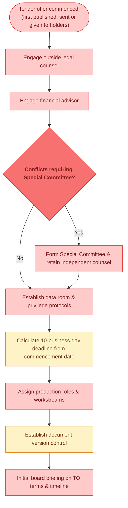

## 🚧 Gate 1: Factual Foundation Lock

> *Before any drafting begins, all transaction facts must be extracted, verified, and locked. Management attests to factual accuracy.*

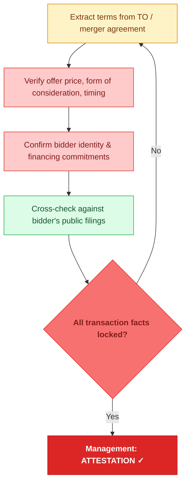

## Stage 1: Subject Company & Offer Overview

> *Covers Items 1–2 (entity identification) plus offer-context facts from locked Gate 1 data. Mostly 🟢 — factual company information compiled from public data and verified inputs. Transaction terms included here for production sequencing, though they feed into Items 3–4 for SEC disclosure purposes.*

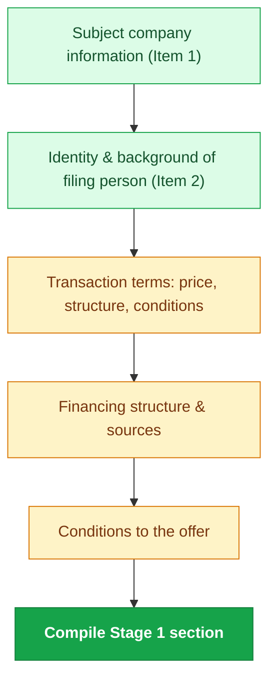

## Stage 2: Background of the Transaction

> *The most sensitive section. Blow-by-blow narrative of how the deal unfolded — covers Item 3 (past contacts, transactions, negotiations and agreements per Reg M-A §229.1005(d)) and provides the factual foundation for the Item 4 recommendation. Heavy 🔴 — board minutes, director interviews, privilege review. LLM can draft narrative from records but every paragraph needs legal review.*

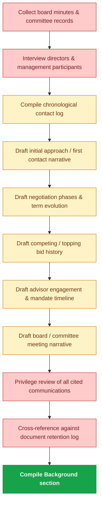

## 🚧 Gate 2: Background Narrative Verification

> *Every factual claim in the background verified against board records. Privilege review ensures no inadvertent waiver. Lead Counsel attests.*

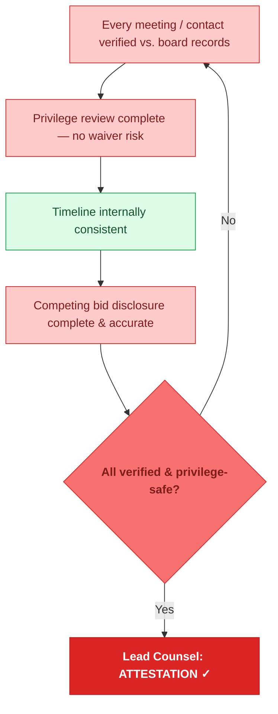

## Stage 3: Financial Analysis & Projections

> *Valuation summary drafting is heavily 🟢 — LLM formats comp tables, precedent transactions, DCF summaries. Management projections (🔴) require board approval. Financial advisor must review final summary for accuracy.*

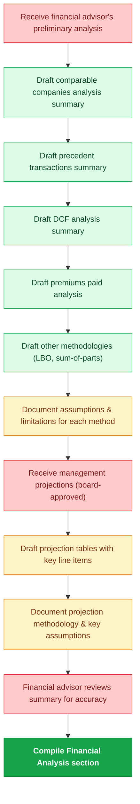

## 🚧 Gate 3: Fairness Opinion Lock

> *Fairness opinion letter received in final form. Summary in the 14D-9 must accurately reflect the full opinion. Financial advisor attests to accuracy.*

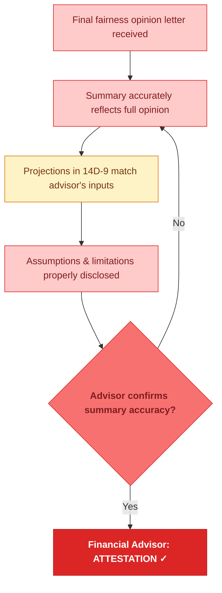

## ⚠ Board Deliberation — Required Before Recommendation

> *New in this workflow. The board must formally deliberate and vote before the Item 4 reasons language can be finalized or circulated. All 7 nodes are 🔴 — this is a purely human governance event. Counsel may prepare alternative drafts in parallel, but no finalization or circulation of Item 4 language until the board locks its position.*

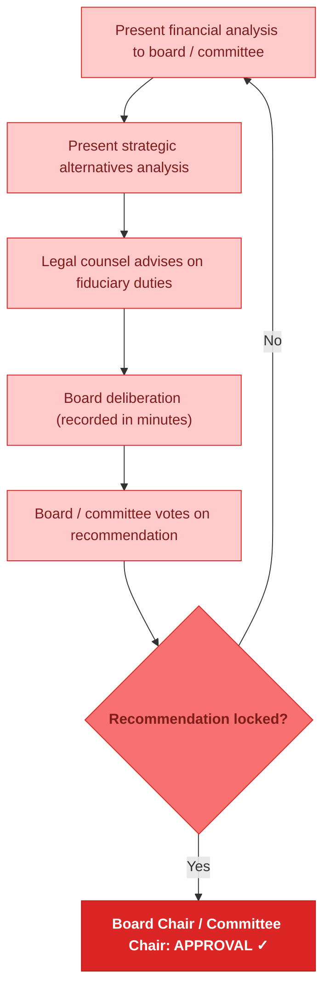

## Stage 4: Recommendation & Reasons

> *Covers Item 4 — The Solicitation or Recommendation (Reg M-A §229.1012). Mostly 🟡 — LLM drafts from board deliberation records, but every sentence needs legal review for fiduciary compliance. Dissenting views (🔴) are board-only. Revlon/Unocal review is outside counsel's domain.*

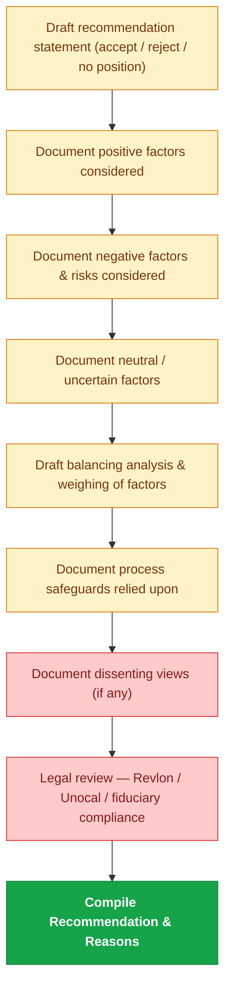

## Stage 5: Conflicts, Interests & Governance

> *Covers Items 5 (persons retained/compensated), 6 (interest in securities), and portions of Item 8 (golden parachute disclosure per Reg S-K Item 402(t), employment arrangements, change-of-control provisions). Mixed 🔴/🟡 — equity holdings and golden parachute math are LLM-computable from data. Change-of-control terms, employment arrangements, and director relationships with the bidder require human disclosure. The Reg S-K Item 402(t) tabular disclosure is provided in the 14D-9 per SEC rules guidance and is typically placed under Item 8.*

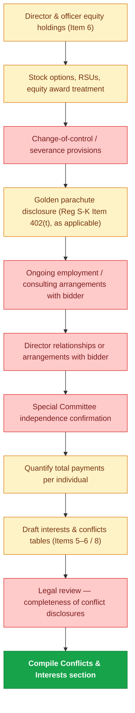

## Stage 6: Legal, Regulatory & Shareholder Rights

> *Covers Item 7 (purposes/plans), portions of Item 8 (appraisal rights, safe harbor language, additional information), and supporting content for Items throughout. Heavy 🔴 — regulatory filings, intent to tender, and SEC compliance are counsel-driven. Appraisal rights drafting (🟡) uses state-law boilerplate but needs jurisdiction-specific review. Safe harbor language is 🟢.*

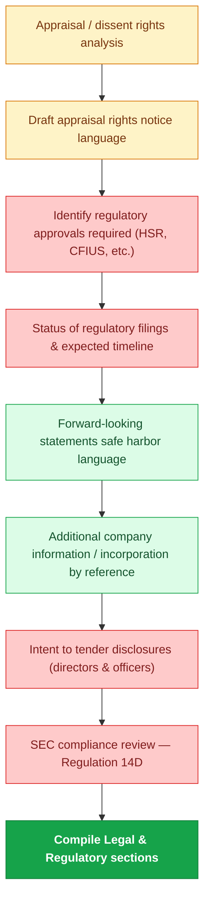

## 🚧 Gate 4: SEC Compliance Lock

> *Regulatory checkpoint. Every Schedule 14D-9 item addressed per the Item Coverage Map, Regulation 14D compliance confirmed, appraisal rights properly noticed. SEC Counsel provides governance prerequisite.*

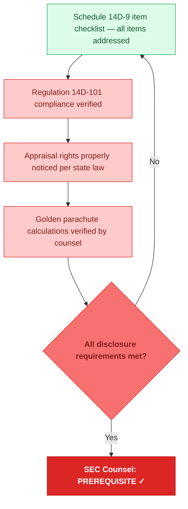

## Stage 7: Exhibits & Final Assembly

> *Covers Item 9 (exhibits). Mixed — exhibit attachment is 🔴 (legal instruments). Shareholder letter drafting is 🟡. Cross-referencing, compilation, and proofing are 🟢. EDGAR formatting is 🟡.*

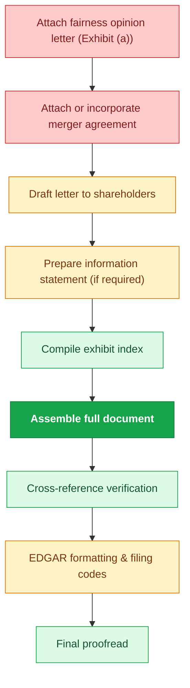

## 🚧 Gate 5: Final Review & Filing Authorization

> *12 QC checks followed by 4-tier sign-off chain. Board authorizes filing as final step before EDGAR submission. Filing must occur within 10 business days of commencement (first published, sent or given to holders). Sign-off order: attestations → certification → approval.*

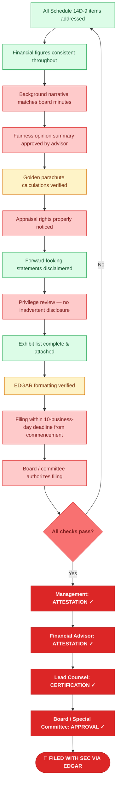

---

## Capability Summary

| Category | Approx. Steps | Examples |
|----------|:---:|---------|
| 🔴 **LLM Cannot Do** | ~66 | Board deliberations, privilege review, sign-offs, fairness opinion, management interviews, director conflicts, SEC compliance, regulatory filings, fiduciary review |
| 🟡 **LLM Needs Human Oversight** | ~34 | Background narrative drafting, projection tables, golden parachute calculations, recommendation factors, appraisal rights language, EDGAR formatting |
| 🟢 **LLM Can Do** | ~26 | Comparable company summaries, precedent transactions, DCF formatting, cross-reference checks, safe harbor language, item checklists, exhibit compilation, proofreading |

## Key Differences from IC Memo Workflow

| Dimension | IC Memo (184 steps) | Schedule 14D-9 (126 steps) |
|-----------|----|----|
| **Primary drafter** | Memo Owner (internal team) | Outside Legal Counsel |
| **Ultimate authority** | Deal Sponsor | Board of Directors / Special Committee |
| **Freeze checkpoint** | Decision-Rights Freeze (lock ask before valuation) | Board Deliberation (lock recommendation before drafting reasons) |
| **Time pressure** | Weeks to months | 10 business days from commencement |
| **Regulatory overlay** | Firm governance only | SEC Regulation 14D, state appraisal law, fiduciary duty standards |
| **Privilege concern** | Confidentiality tiers | Attorney-client privilege — inadvertent waiver risk |
| **LLM-heavy areas** | Market research, comps, scenario modeling | Valuation summaries, financial tables, boilerplate legal language |
| **LLM-restricted areas** | Sign-offs, deal terms, personnel | Board decisions, privilege review, fiduciary analysis, conflict disclosures |
| **Red/Yellow/Green split** | 62 / 66 / 56 (34% / 36% / 30%) | 66 / 34 / 26 (52% / 27% / 21%) |

## v1.1 Change Log

| # | Issue | Fix |
|---|-------|-----|
| 1 | Trigger for 10-business-day deadline was "TO filed" | Changed to "commencement (first published, sent or given to holders)" per Rule 14e-2(a) and Rule 14d-2 |
| 2 | Stage 1 labeled "Items 1–2" but included offer terms; Stage 5 labeled "Item 3" for conflicts | Stage 1 renamed "Subject Company & Offer Overview"; Item labels on individual nodes clarify Items 1–2 are identity only. Stage 5 conflicts table now references Items 5–6 / 8. Added Item Coverage Map. |
| 3 | Golden parachute 402(t) lacked proper SEC context | Node relabeled; Item Coverage Map places under Item 8 per SEC rules guidance |
| 4 | Item 7 description said "Regulatory filings, strategic alternatives" | Corrected to purposes/plans/proposals per Reg M-A Item 1006(d): merger, delisting, asset sales, board changes, dividend policy |
| 5 | Stage 6 node "Information about the subject company" duplicated Item 1 | Renamed "Additional company information / incorporation by reference" to clarify Item 8 catch-all role |
| 6 | 402(t) node framed as "14D-9 Item" | Corrected to "Reg S-K Item 402(t), as applicable" — 402(t) is Regulation S-K, not a Schedule 14D-9 item |
| 7 | Board Deliberation Freeze imposed hard ban on drafting | Softened to allow parallel drafting; ban applies to finalization/circulation of Item 4 language until board locks position |

## Usage

1. **Clone** this repo and open the `.mermaid` file in any Mermaid-compatible viewer.
2. **README.md** renders natively on GitHub with embedded flowcharts.
3. **HTML presentation** opens in any browser — dark-themed, scroll-animated, sidebar navigation.

---

*Schedule 14D-9 Production Workflow v1.1 | LLM Capability Map | Confidential*
